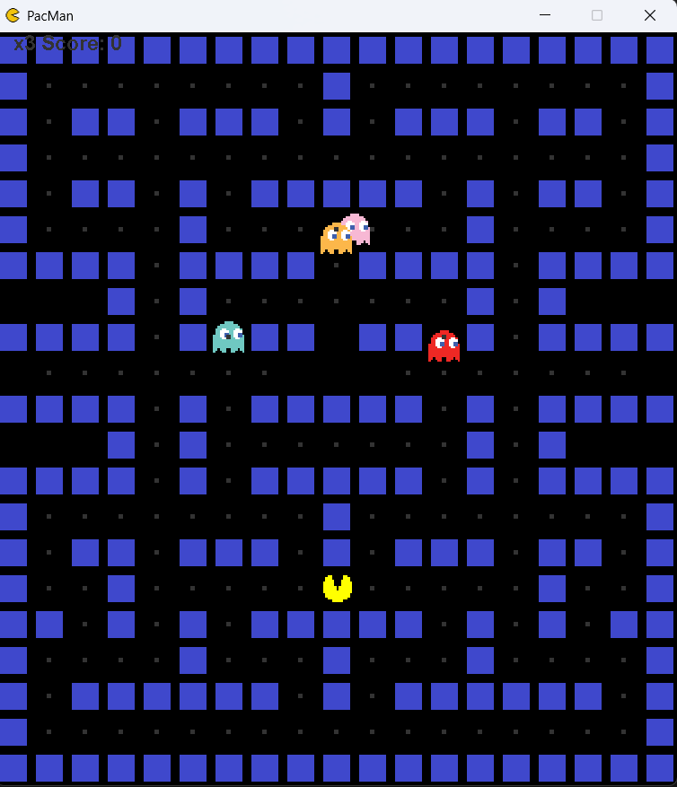
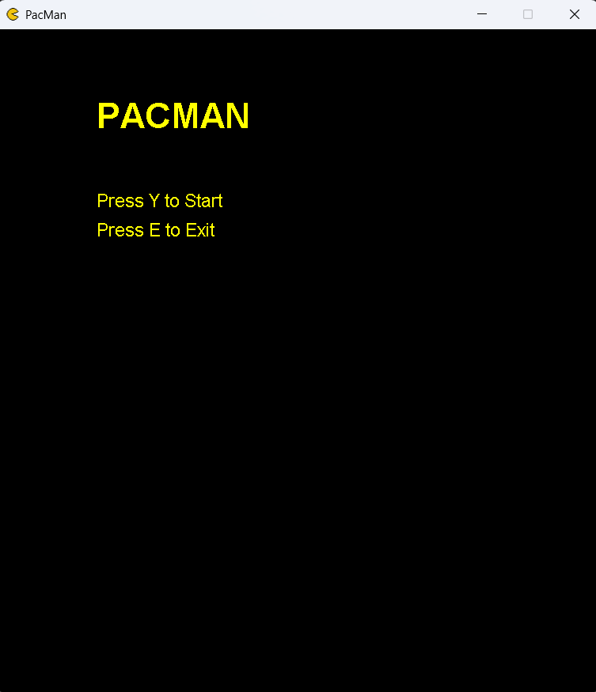
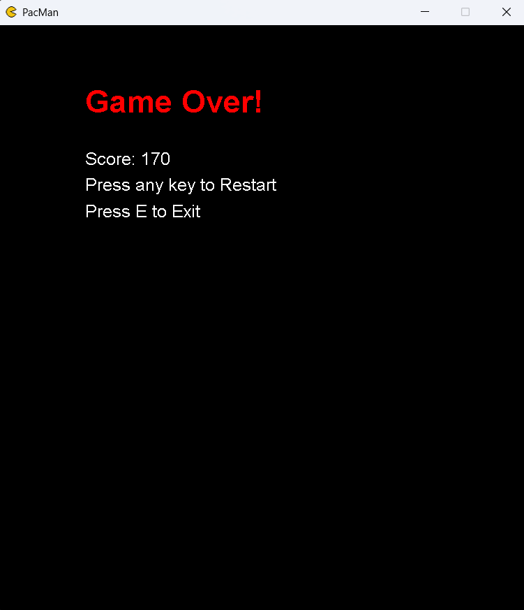

# Pac-Man Java Game 🟡👻

A classic Pac-Man clone written in Java using Swing.  
Control Pac-Man with the arrow keys, avoid ghosts, eat dots, and navigate a clean menu and game over screen.

---

## 🎮 Features

- Grid-based level with dots, walls, and ghosts
- Menu screen to start or exit the game
- Game over screen with restart option
- Simple scoring system and life counter
- Timer-based game loop using `javax.swing.Timer`
- Basic random movement for ghosts
- Fully keyboard-controlled

---

## 🛠 Built With

- Java (Swing)
- `paintComponent` for rendering
- `javax.swing.Timer` for game loop
- Key event handling (`KeyListener`)

---

## 📸 Screenshots

<<<<<<< HEAD



=======
  
  


---
>>>>>>> a9cffc7 (Update project files)

## 💡 Inspirations

This project is **heavily inspired** by the  
[Kenny Yip Coding Pac-Man tutorial](https://youtu.be/lB_J-VNMVpE?si=LC43q_Ri0yXfrKoj).  

Changes made:
- Added a menu and game over screen  
- Used a `gameState` string instead of just a `gameOver` boolean  
- Refactored input logic and screen rendering

---

## 🚀 How to Run

1. Compile:
   ```bash
   javac App.java
   ```

2. Run:
   ```bash
   java App
   ```

---

## 📁 Folder Structure

```
pacman/
│
├── App.java
├── PacMan.java
├── images/
│   ├── pacman.png
│   ├── ghost.png
│   ├── wall.png
│   └── ...
└── README.md
```

---